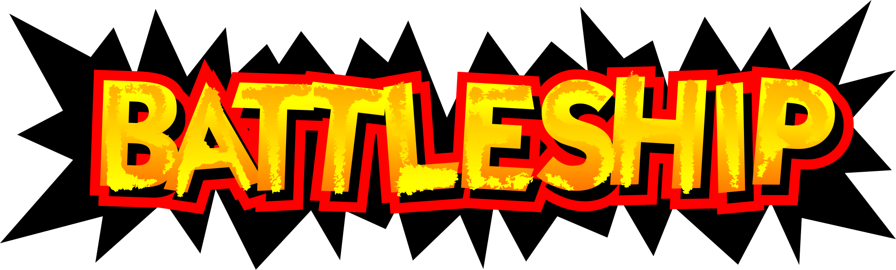

<p align="center">
  
</p>

# BattleShip

**BattleShip** is a PC port of **Super Smash Bros. (N64, NTSC-U v1.0)** built on top of the [VetriTheRetri/ssb-decomp-re](https://github.com/vetritheretri/ssb-decomp-re) decompilation, using [libultraship](https://github.com/Kenix3/libultraship) for PC-native rendering / audio / input and [Torch](https://github.com/HarbourMasters/Torch) for extracting assets out of the ROM at build time.

Runs natively on macOS (Apple Silicon), Linux, and Windows.

Android is planned and work-in-progress.

## No copyrighted assets are included in this repository

**None of Nintendo's assets (code, textures, audio, models, text, ROM data) are checked into this repo or distributed with builds.** The port is a pure C/C++ source tree; every byte of Nintendo-owned data is extracted at build time from a ROM that *you* supply. If you do not own a legal copy of Super Smash Bros. for the Nintendo 64, you cannot build or run this project.

The required ROM is **NTSC-U v1.0** (game code `NALE`, internal name `SMASH BROTHERS`):

| Hash   | Value                                      |
|--------|--------------------------------------------|
| SHA‑1  | `e2929e10fccc0aa84e5776227e798abc07cedabf` |
| MD5    | `f7c52568a31aadf26e14dc2b6416b2ed`         |

If your dump does not match those hashes, it will not work.

## Features

### Toggleable Port Specific Enhancements

- Tap Jump
- C-Stick Smash
- D-Pad Jump
- Hitbox Visual Mode
- Nrage Stick Config with Customizable Ranges

## Controls

- Controller and Rumble Support Powered by SDL 2
- Native Raphnet Support up to 4 Channels Through Hidapi

## Rendering

All Powered by LibultraShip

- Resolution scaling
- Anti Aliasing
- Tri Point Texture Filtering

## Rollback Netcode and Online Play (WORK IN PROGRESS)

## Mod Loader and Toolkit (WORK IN PROGRESS)

- Modding Toolkit is available as a submodule [Battle-ShipYard](https://github.com/JRickey/Battle-ShipYard)
- Mod loader is Work in Progress

## Author's notes

### About the project

This is a work in progress port that I started and developed alone with Claude until the v0.3-beta release. It took a little over a month of night and day work to get to the first beta release, and a massive 4 day long sprint working all day resolving bugs from v0.3-beta to v0.7-beta. As of now, this is no longer a pure AI project. Many people have offered their time playtesting, their knowledge of the game, or their experience with modding or competitive play; to bring improvements, bug fixes, new feature suggestions, and additions. Without them, the project would not be what it is today.

If you find anything that you would like to see improved, create an issue on Github. I'll fix it.

This port was started when the original decomp was 96% complete code only. The remaining 4% is the internal debug menu and Libultra functions that aren't necessary to port the game. The relocatable data was also not decompiled at the time. The port was designed with this in mind, and it is why certain design decisions had to have been made. I like to move fast, obviously.

This project uses a heavily modified LibUltraShip and Torch, those two modules obviously don't work with every n64 game out of the box and a lot of game specific things needed to be implemented. The original game is quite unique and uses rendering techniques and n64 hardware tricks in ways other LUS projects did not need to account for.

This is a passion project for me. Not out of nostalgia, but to actually make something. I don't have too much nostalgia for the original game, considering I didn't own a copy as a kid, but I remember playing it at a friend's house a handful of times. What motivates me to work on this is because I can. Because it's hard, because it hasn't been done before (at least not open source). It's required a ton of my personal time, even using AI. It's forced me to get creative, to design custom tools, to force the agents into certain boxes.

People may not like it because I used AI, and that's okay. I'm not going to argue with your opinion or try to say that my way is the correct way of doing things. It works for me and that's what matters to me. My code is open source, it's free, it's MIT Licensed, and everyone can learn from it. That's what should matter to you.

I hope you enjoy the project.

---

## Building

If you want to manually compile BattleShip, please consult the [building instructions](BUILDING.md).

## Architecture

The port has three layers and they are kept deliberately separate:

```
┌──────────────────────────────────────────────────────────────┐
│  decompiled game code  (decomp/src/)                         │
│  Unmodified C produced by the decomp project. Talks to the   │
│  N64 the same way the original ROM did: GBI display lists,   │
│  ALSeqPlayer audio, OS threads, OSContPad input.             │
├──────────────────────────────────────────────────────────────┤
│  port layer            (port/)                               │
│  Modern C++ glue. Translates N64-shaped APIs into LUS calls, │
│  fixes endianness on freshly-loaded data, owns Ship::Context │
│  and the resource factories, and quarantines every change    │
│  the decomp doesn't need to know about.                      │
├──────────────────────────────────────────────────────────────┤
│  libultraship         (libultraship/)                        │
│  PC-native runtime: Fast3D renderer (OpenGL / Metal / D3D),  │
│  SDL2 input, miniaudio output, OTR/O2R resource manager,     │
│  ImGui overlay.                                              │
└──────────────────────────────────────────────────────────────┘
```

### Asset pipeline

`baserom.us.z64` is never read at runtime. At build time, **Torch** walks the ROM with the YAMLs under `yamls/us/` and emits `BattleShip.o2r` — a zip-format archive of typed resources (textures, sequences, sample banks, animations, reloc files). At launch, libultraship's resource manager mounts `BattleShip.o2r` + `f3d.o2r` and the port code requests resources by path. This is the same pipeline used by Ship of Harkinian, Starship, SpaghettiKart, etc.

The relocatable-data files (fighter tables, item tables, effects, sprites) are SSB64-specific and required custom factories on the Torch side and a custom loader (`port/resource/RelocFileFactory.cpp`) on the runtime side. They can also be built straight from decomp source — the [Battle-ShipYard](https://github.com/JRickey/Battle-ShipYard) submodule recompiles `decomp/src/relocData/*.c` end-to-end (i686 cross-compile → ELF/COFF parse → byteswap to BE → reloc-chain encoding → LUS RelocFile resource emit) into a parallel `BattleShip.fromsource.o2r` archive that the runtime loads ahead of the Torch-extracted bytes when `SSB64_RELOC_FROMSOURCE=1` is set, shadowing matching entries via LUS's FIFO ArchiveManager lookup. Both archives feed the same `RelocFileFactory.cpp` loader. See the **Modding** section below.

### Build-time codegen

A small amount of generated code lives outside the source tree (gitignored) and is regenerated on every build from `tools/reloc_data_symbols.us.txt`:

- `include/reloc_data.h` — extern declarations for every relocatable symbol
- `yamls/us/reloc_*.yml` — Torch extraction configs
- `port/resource/RelocFileTable.cpp` — the runtime symbol table

If you ever see "undefined reference to `dFooBarReloc`" you regenerated the table without rebuilding, or vice versa.

When a clang or MSVC toolchain is on the build host, the [Battle-ShipYard](https://github.com/JRickey/Battle-ShipYard) submodule additionally produces `BattleShip.fromsource.o2r` at build time — 1,870 source-compiled relocData files plus 262 passthroughs, runtime-equivalent to the Torch-extracted bytes (verified by the toolkit's symbol-aligned equivalence validator). The archive is optional: with no toolchain available the build proceeds with Torch-extracted reloc data only and the runtime is unchanged.

---

## Code conventions

### `#ifdef PORT` — what it is and what it isn't

Every meaningful change to a decomp source file is wrapped in `#ifdef PORT` / `#else` / `#endif`. The discipline this enforces:

- **The original decomp code path stays intact and compilable** under the IDO toolchain on a real N64 build. This is non-negotiable — if it ever stops being true, upstreaming improvements back to the decomp project becomes impossible.
- **The PORT branch is allowed to be ugly** — an explicit endian conversion, a struct rewrite, a function shim — as long as the contract it presents to the rest of the file is the same as the N64 branch.
- **Reloc tokens vs. raw pointers**: a field declared `u32` under `#ifdef PORT` where the N64 branch declared `T*` is a *reloc token*, not a raw pointer. Resolving it requires `PORT_RESOLVE(token)`. Assigning a real pointer with `(uintptr_t)ptr` will silently truncate on LP64 — wrap post-load writes in `PORT_REGISTER`.

### Decomp preservation: behavior, not bytes

The repo follows a single principle for changes to `decomp/src/`:

> **Accuracy to game behavior > accuracy to ROM bytes.**

That means IDO idioms that encode original N64 semantics — odd casts, `goto` flow, deliberate temporaries — are load-bearing and stay. But **compiler-compat shims** (warning suppressions, permissive flags, header shortcuts) that mask real bugs on modern LP64 toolchains do *not* survive. The most expensive lesson of the project was that `-Wno-implicit-function-declaration` was silently truncating 64-bit pointer returns to 32-bit `int` in dozens of places — see `docs/bugs/item_arrow_gobj_implicit_int_2026-04-20.md`. The shim is gone; the real declarations are in.

### Naming prefixes

The decomp uses two-letter module prefixes throughout. Knowing them makes the source tree navigable:

| Prefix | Meaning |
|--------|---------|
| `ft`   | Fighter (`ftMario`, `ftKirby`, `ftFox`, …) |
| `it`   | Item (`itAttribute`, `itManager`) |
| `wp`   | Weapon |
| `ef`   | Effect / particle |
| `gm`   | Game mode |
| `gr`   | Stage (ground) |
| `mp`   | Map / collision |
| `mn`   | Menu |
| `sc`   | Scene |
| `sy`   | System (engine internals) |
| `sf`   | Saved-state / save file |
| `db`   | Debug |
| `cm`   | Camera |
| `lb`   | Library (low-level utilities) |
| `obj`  | GObj / DObj / OMObj — game-object wrappers |

Full reference: [`docs/c_conventions.md`](docs/c_conventions.md).

### Endianness handling

The N64 is big-endian; PC targets are little-endian. The port handles this in three layers:

1. **Gross byteswap at load** — `lbRelocLoadAndRelocFile` byteswaps relocatable files word-by-word during load.
2. **Per-struct fixups** — small `portFixupStructU16` / `portFixupStructU8` helpers fix sub-word fields that the gross swap got wrong (e.g., `{u16, u8, u8}` patterns where the two `u8`s end up swapped).
3. **Per-stream walkers** — animation events, spline interpolators, and other variable-length streams are halfswapped at file-bake time and need a per-stream un-halfswap on first access. These live in `port/port_aobj_fixup.{h,cpp}` and friends.

If you find a new struct that reads garbage, the playbook in `docs/n64_reference.md` will tell you which layer it belongs in.

### Bitfield layout

The IDO compiler packs small bitfields into preceding `u16` pad gaps, MSB-first. Modern compilers (Clang, GCC) on LE targets pack LSB-first into the next storage unit. Bitfield structs that travel through file data must be **rewritten under `#ifdef PORT`** to match the IDO physical layout — see `docs/debug_ido_bitfield_layout.md` for the workflow (compile + rabbitizer disasm to verify bit positions before porting).

Patching the *reads* in game code instead of the *layout* is forbidden by team policy; the bug always comes back. See `feedback_struct_rewrite_over_overrides.md` in the project's memory for the long version.

---

## Why the submodules are forks

Both `libultraship` and `torch` are pinned to **personal forks** rather than the upstream Harbour Masters repos, because each needs SSB64-specific changes that don't exist upstream.

### [`libultraship`](https://github.com/JRickey/libultraship/tree/ssb64) — fork of [Kenix3/libultraship](https://github.com/Kenix3/libultraship)

SSB64 drives the RDP differently than the Zelda / Mario 64 / Star Fox 64 titles libultraship was originally built for — in particular around tile masks, `SetTileSize` extents, IA/I4 texture uploads, `gDPSetPrimDepth` for 2D layering, and Metal sampler binding for matanim CCs. Upstreaming the fixes is on the list, but until then the fork carries:

- Clamping `ImportTexture*` upload width/height to the active `SetTileSize` extent (fixes the fighter "black squares" bug and the IA8/I4 stretch bug)
- Honouring `SetTile` mask/maskt in the Import* path
- A real implementation of `gDPSetPrimDepth` (was a `TODO Implement` stub upstream — broke every `G_ZS_PRIM` 2D sprite)
- A 1×1 black fallback texture for sampler slots that would otherwise alias the screen drawable on Metal (fixed the Whispy canopy stripe)
- A no-logging path in `IResource`'s destructor to prevent a shutdown-time crash

### [`torch`](https://github.com/JRickey/Torch/tree/ssb64) — fork of [HarbourMasters/Torch](https://github.com/HarbourMasters/Torch)

Torch is the tool that reads the ROM and emits `BattleShip.o2r`. Upstream supports OoT, MM, SF64, MK64, PM64, etc., but has no knowledge of SSB64's file formats. The fork adds:

- An `SSB64` build flag and game target
- A reloc-file factory for SSB64's relocatable data blobs (fighters, items, effects, sprites)
- `libvpk0` integration for VPK0-compressed segments

Both forks live as submodules so their history stays their own and so upstream changes can be merged in cleanly when/if the fixes are accepted.

---

## Modding

Source-level modding is supported via the [Battle-ShipYard](https://github.com/JRickey/Battle-ShipYard) submodule — a CMake-driven toolkit that recompiles `decomp/src/relocData/*.c` (fighter attributes, animations, stage data, particle effects, weapon hitboxes — anything the runtime relocates from a per-file body) into a sideloadable `BattleShip.fromsource.o2r`. Drop the archive next to your `BattleShip.exe` and launch with `SSB64_RELOC_FROMSOURCE=1` in the environment to load it ahead of the ROM-extracted data.

Either toolchain works:

- **clang** (any host) — `winget install LLVM.LLVM` on Windows, ships with Xcode CLI tools on macOS, `apt install clang` on Linux.
- **MSVC** (Windows only) — VS 2017+ or Build Tools with the *Desktop development with C++* workload. Auto-detected via `vswhere`; the toolkit captures `vcvars32` once at configure time and runs `cl.exe` through a generated env wrapper, so no Developer Shell launch is required.

Both backends produce runtime-equivalent archives across the full 1,870-file eligible-set — verified by the modkit's symbol-aligned equivalence validator. The remaining ~262 files (JP-only overlays, files needing upstream `.inc.c` extracts, IDO bitfield-init structs) are passed through unchanged from the Torch-extracted bytes.

A mod loader for installing and managing multiple mods at runtime is planned but not yet implemented; for now, sideloading is one-archive-at-a-time via the env var. See the [Battle-ShipYard README](https://github.com/JRickey/Battle-ShipYard#readme) for the full toolkit reference, per-tool docs, and the build flow for both standalone and submodule usage.

---

## Repo layout

```
port/         modern C++ port layer — Ship::Context, resource factories,
              endian fixups, bridges between decomp code and libultraship
include/      headers (some generated: reloc_data.h)
decomp/       submodule — decompiled SSB64 C source (largely unchanged
              game logic). Major subdirs inside the submodule:
                src/sys/        main loop, DMA, scheduling, audio,
                                controllers, threading
                src/ft/         fighters (ftmario/, ftkirby/, ftfox/, …)
                src/sc/ gm/ gr/ scene / game modes / stage rendering
                src/mn/ it/ ef/ menus / items / effects
                src/relocData/  reloc data sources (Battle-ShipYard input)
libultraship/ submodule — PC-native render / audio / input / resource mgr
torch/        submodule — asset extractor (ROM → BattleShip.o2r)
Battle-ShipYard/  submodule — modding toolkit (decomp source → BattleShip.fromsource.o2r)
yamls/us/     Torch YAML extraction configs (some generated)
tools/        Python helpers: reloc stubs, YAML gen, credits encoder
docs/         architecture notes, bug write-ups, debugging guides
debug_tools/  optional disasm / diff utilities (not required for a build)
scripts/      packaging (.dmg / .AppImage / .zip), worktree helper
```

### Further reading

- [`docs/architecture.md`](docs/architecture.md) — project status, ROM info, dependency map, source-tree layout
- [`docs/c_conventions.md`](docs/c_conventions.md) — decomp naming prefixes, IDO idioms to preserve, code style, macros
- [`docs/n64_reference.md`](docs/n64_reference.md) — RDRAM, RSP/RDP, GBI, audio, threading, endianness primer
- [`docs/build_and_tooling.md`](docs/build_and_tooling.md) — CMake details, reloc stub regen, runtime logs, LP64 compat notes
- [`docs/debug_gbi_trace.md`](docs/debug_gbi_trace.md) — capturing GBI traces from the port and a M64P plugin, diffing with `gbi_diff.py`
- [`docs/debug_ido_bitfield_layout.md`](docs/debug_ido_bitfield_layout.md) — verifying ported struct bit positions against IDO output via rabbitizer
- [`docs/bugs/README.md`](docs/bugs/README.md) — index of resolved bugs with per-bug root-cause and fix write-ups (~45 entries)

---

## Contributing

PRs are welcome but please don't be offended if responses are slow — this is a side project. If you're opening a bug report, the most useful things to include are:

- SHA-1 of your `baserom.us.z64`
- OS + architecture (especially macOS ARM64 vs x86_64, since LP64 bitfield layout has bitten us several times — see `docs/bugs/`)
- The contents of `ssb64.log` from the run that reproduces the issue
- A GBI trace if the issue is rendering-related (see `docs/debug_gbi_trace.md`)

## Credits & licensing

- Game code, data, sound, textures, models, and trademarks: **© Nintendo / HAL Laboratory.** Not included in this repository, not redistributed, and not endorsed by them.
- Decompilation: [VetriTheRetri/ssb-decomp-re](https://github.com/VetriTheRetri/ssb-decomp-re) and its contributors.
- Runtime framework: [libultraship](https://github.com/Kenix3/libultraship) (Kenix3 and the Harbour Masters team).
- Asset pipeline: [Torch](https://github.com/HarbourMasters/Torch) (Harbour Masters).
- Menu fonts: [Montserrat](https://github.com/JulietaUla/Montserrat) and [Inconsolata](https://github.com/cyrealtype/Inconsolata), both bundled under the [SIL Open Font License 1.1](https://openfontlicense.org). License texts ship alongside the font files in [`assets/custom/fonts/`](assets/custom/fonts/).
- Reference ports I learned from: [Starship](https://github.com/HarbourMasters/Starship) (SF64), [SpaghettiKart](https://github.com/HarbourMasters/SpaghettiKart) (MK64).
- Port work: me ([JRickey](https://github.com/JRickey)), with an enormous amount of help, debugging, and feature suggestions from contributors in our Discord server.

This project is **not affiliated with, endorsed by, or authorized by Nintendo.** It is a personal, non-commercial research and preservation effort. Do not upload ROMs, extracted `.o2r` archives, or any other Nintendo-owned data to issues or pull requests.

This project is **not affiliated with, endorsed by, or authorized by Harbour Masters** either. It uses libultraship (originated by the Harbour Masters team and now maintained at [Kenix3/libultraship](https://github.com/Kenix3/libultraship)) and Torch (the [HarbourMasters/Torch](https://github.com/HarbourMasters/Torch) asset extractor) as upstream dependencies via personal forks, but it is an independent fan effort. Issues, bugs, and support questions about this port should not be directed to the Harbour Masters team.

## License

Source code in this repository (everything outside the `decomp/`, `libultraship/`, `torch/`, and `Battle-ShipYard/` submodules — each of which carries its own attribution) is released under the [MIT License](LICENSE) — free to use, modify, and redistribute, with no warranty and no liability. See [`LICENSE`](LICENSE) for the full text.

The MIT grant covers only the port-specific code (the `port/` layer, build scripts, tools, docs). It does **not** extend to:
- Game assets, code, audio, textures, models, or any other content owned by Nintendo / HAL Laboratory — none of which is in this repository.
- The decompilation in the `decomp/` submodule, which carries its own license from the [VetriTheRetri/ssb-decomp-re](https://github.com/VetriTheRetri/ssb-decomp-re) project.
- The `libultraship` and `torch` submodules, which carry their own upstream licenses.
- The `Battle-ShipYard` modkit submodule, which is MIT-licensed under its own [LICENSE](https://github.com/JRickey/Battle-ShipYard/blob/main/LICENSE).
- The bundled menu fonts under `assets/custom/fonts/`, which are licensed under the SIL Open Font License 1.1 (per-font license files in that directory).
